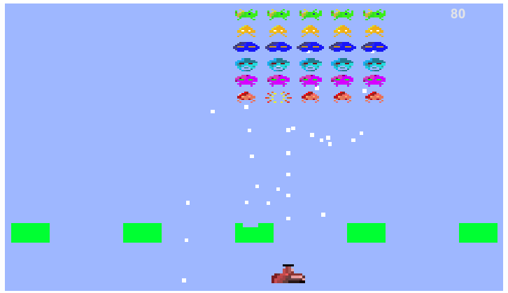

# UnitySpaceInvaders
---
This is a recreation of the classic "Space Invaders" arcade game. It was built using C# in the Unity IDE. The game is rather unpolished and incomplete, because this project was simply a learning experience. While this game has been done 1000s of times, this repository serves as a fantastic template for a shooter style of game.

